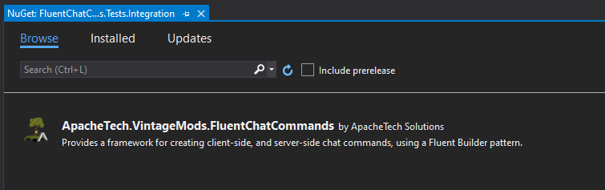

# Fluent Chat Commands

Provides a framework for creating client-side, and server-side chat commands, using a Fluent Builder pattern. Supports lazy loading of chat commands, where they can be registered early, and configured at any stage.

The main idea is to simplify the process of writing complex commands, as well as separating the construction, business logic, and registration of chat commands.

The syntax string for the command is set automatically, by the sub-commands that are added. A command with no default handler, and no sub-commands, returns its help message to the user.

## Pre-requisites

This package assumes that you have [Vintage Story](https://vintagestory.at/) installed on the computer, and that you have set the following environment variables, as per the Vintage Story Modding Best Practices.

 * **%VINTAGE_STORY%**: The installation directory for Vintage Story. The location of *Vintagestory.exe*. By default this is *%APPDATA%\Vintagestory*.
 
 * **%VINTAGE_STORY_DATA%**: The data directory for Vintage Story. By default this is *%APPDATA%\VintagestoryData*. However, you can check by opening the game, going to the Mod Manager, selecting *Open Mods Folder*, and going to the parent folder.

You can also do this through the Windows Control Panel, following these steps:

- **Windows 10 and Windows 8**
    1. In *Search*, search for and then select: *System (Control Panel)*
    2. Click the *Advanced* system settings link.
    3. Click *Environment Variables*. In the section *System Variables* (for All Users), or *User Variables* (for just the Current User), find the PATH environment variable and select it. Click Edit. If the PATH environment variable does not exist, click New.
    4. In the *Edit System Variable* (or *New System Variable*) window, specify the value of the PATH environment variable. Click *OK*. Close all remaining windows by clicking OK.
    
- **Windows 7**

    1. From the desktop, right click the *Computer* icon.
    2. Choose *Properties* from the context menu.
    3. Click the *Advanced* system settings link.
    4. Click *Environment Variables*. In the section *System Variables* (for All Users), or *User Variables* (for just the Current User), find the PATH environment variable and select it. Click *Edit*. If the PATH environment variable does not exist, click New.
    5. In the *Edit System Variable* (or *New System Variable*) window, specify the value of the PATH environment variable. Click OK. Close all remaining windows by clicking OK.

Further details and troubleshooting can be found [here](https://www.computerhope.com/issues/ch000549.htm).

## Installation

You can install this package through the Package Manager within Visual Studio, by searching for `ApacheTech.VintageMods`.



You can install this package through the Package Manager Console, by using the command:

```cmd
Install-Package ApacheTech.VintageMods.FluentChatCommands -Version 1.0.0
```

If using the `nuget.exe` CLI application, you can use the following command:

```cmd
nuget install ApacheTech.VintageMods.FluentChatCommands -Version 1.0.0 
```

You can also manually install the package, by editing your `.csproj` file, and adding the following section:

```xml
	<ItemGroup>
	  <PackageReference Include="ApacheTech.VintageMods.FluentChatCommands" Version="1.0.0" />
	</ItemGroup>
```

## Examples

### Basic Example

In this example, we're setting a command called `.test`, with a basic default command handler.
```cs  
    internal class MyMod : ModSystem
    {
        // ...
        
        public override void StartClientSide(ICoreClientAPI capi)
        {
            FluentChat.ClientCommand("test")
                .HasDescription("This is a test command.")
                .HasDefaultHandler((_,_) => capi.ShowChatMessage("Hello, World!"))
                .RegisterWith(capi);
        }
        
        // ...
    }
```

### Basic Example with Sub-Commands

In this example, we're setting a command called `.test`, with a basic default command handler, but also setting separate sub-commands for `.test stuff` and `.test things`. The only difference between the sub-commands is that one uses a lambda expression for its handler, and the other separates it's logic into a named method.
```cs  
    internal class MyMod : ModSystem
    {
        // ...
        
        private ICoreClientAPI _capi;
        
        public override void StartClientSide(ICoreClientAPI capi)
        {
            FluentChat.ClientCommand("test")
                .HasDescription("This is a test command")
                .HasDefaultHandler((_,_) => capi.ShowChatMessage("Hello, World!"))
                .HasSubCommand("stuff")
                .WithHandler(StuffHandler)
                .HasSubCommand("things")
                    .WithHandler((_,_) => capi.ShowChatMessage("Doing Things!"))
                .RegisterWith(_capi = capi);
        }
        
        private void StuffHandler(string subCommandName, int groupId, CmdArgs args)
        {
            _capi.ShowChatMessage("Doing Stuff!");
        }
        
        // ...
    }
```

### Advanced Example with Separation of Concerns

Here, we lazy load the `/test` command by immediately registering it with the API. 
```cs  
    internal class MyMod : ModSystem
    {
        // ...
        
        public override void StartServerSide(ICoreServerAPI sapi)
        {
            FluentChat.ServerCommand("test").RegisterWith(sapi);
        }
        
        // ...
    }
```

We can then separate our logic into a separate class; even within a separate assembly.
```cs  
    internal class TestChatCommand
    {
        private ICoreServerAPI _sapi;
        
        internal TestChatCommand(ICoreServerAPI sapi)
        {
            _sapi = sapi;
            var command = FluentChat.ServerCommand("test");
            
            // Set Description:
            command.HasDesctiption(Lang.Get("mymod:commands.test.description"));
            
            // Set Default Handler:
            command.HasDefaultHandler(DefaultHandler);
            
            // Set Required Privilege:
            command.RequiresPrivilege(Privilege.ControlServer);
            
            // Set Stuff Handler:
            command.HasSubCommand("stuff").WithHandler(StuffHandler);
            
            // Set Things Handler:
            command.HasSubCommand("things").WithHandler(ThingsHandler);
        }
    
        private void DefaultHandler(string subCommandName, IServerPlayer player, int groupId, CmdArgs args)
        {
            // Do stuff and things.
        }
    
        private void StuffHandler(string subCommandName, IServerPlayer player, int groupId, CmdArgs args)
            CmdArgs args)
        {
            // Do stuff.
        }
        
        private void ThingsHandler(string subCommandName, IServerPlayer player, int groupId, CmdArgs args)
        {
            // Do things.
        }
    }
```